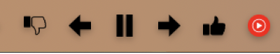
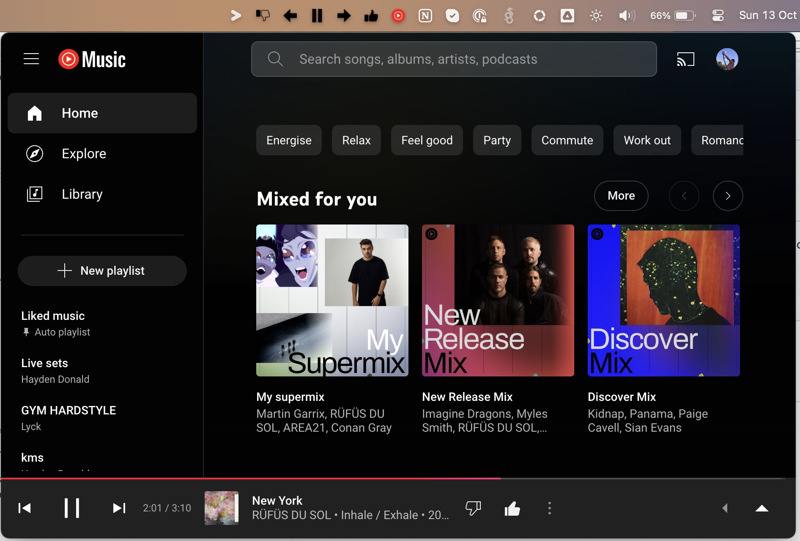
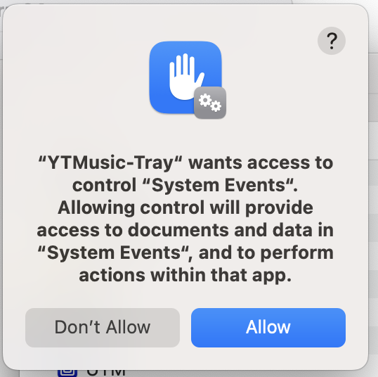

# YT Music Tray
A simple application to run Youtube Music within the windows tray or mac menubar

## Tray button


## Youtube Music browser


## Supported
* macOS

# Features
* Play/Pause button
* Next/Previous track button
* Like/Dislike button
* Youtube Music will open in a floating window
* Will stay logged in

# Future aims
* Track notification
* Custom selection/order of buttons
* Create executable for mac
* Create executable for windows
* Create executable for linux

# Installation
This project is not released yet, have a look at development to try it yourself

## Development
* Clone the repository
* Run `npm i` to install dependencies
* Run `npm run dev` to run in development mode
* Run `npm run build` to build the project
* Run `npm run start` to run the application
* Run `npm i -g electron-builder` to install electron-builder to build the executables

At the moment this app requires a PR to be pulled into menubar for this project to function properly. Do fix this run the following:
```bash
cd ./node_modules/
rm -rf menubar
git clone https://github.com/haydendonald/menubar
cd menubar
yarn install
yarn build
```

# FAQ
### What's this???


This comes up because we use system events to open the app at login.

### How is my login stored?
When a new cookie comes in i simply pass this to use the session cookies from Electron. It will restore the cookies when the app reloads